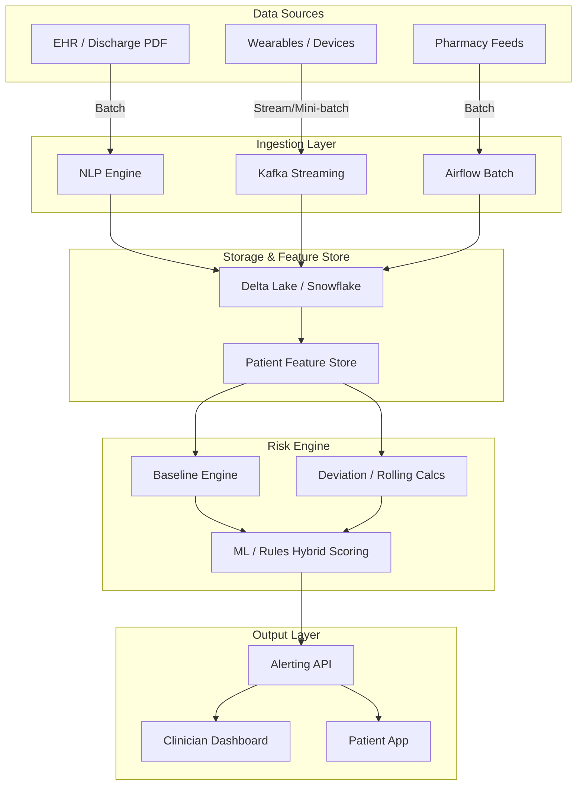

# Multimodal Readmission Risk Detection System Architecture

## 1. Problem Framing (Clinical + Data Perspective)

**The Clinical Problem:** 
Heart Failure (CHF) readmissions are highly prevalent and costly. Post-discharge patients often face a vulnerable period where subtle physiological changes and medication mismanagement lead to acute decompensation.

**Why Static Prediction Fails:**
Traditional ML models (like LACE or HOSPITAL scores) rely on data available *at the time of discharge* (e.g., length of stay, comorbidities). These are static. They fail to capture what happens when the patient goes home: do they take their meds? Is fluid accumulating? 

**The Solution: Temporal Deterioration Detection:**
We must shift from "predicting risk at discharge" to "detecting dynamic deterioration post-discharge." By tracking continuous, longitudinal data against a patient's own steady-state baseline, we can identify early deviations before they become critical emergencies.

**Key Signal Categories:**
1. **Physiological (Wearables):** Weight (fluid retention), Resting HR (cardiovascular stress), Steps (functional decline), SpO2 (hypoxia).
2. **Behavioral (Pharmacy/Adherence):** Prescription fill gaps, formulary rejections, polypharmacy interactions.
3. **Clinical Baseline (EHR):** LVEF (Ejection Fraction), NT-proBNP, comorbidities extracted via NLP from discharge summaries.

---

## 2. System Architecture



**Component Details:**
*   **Ingestion:** Kafka handles high-frequency wearable data (near-real-time). Airflow orchestrates daily batch jobs for pharmacy claims and EHR syncs. NLP extracts unstructured clinical baselines from PDFs.
*   **Feature Store:** A low-latency store (e.g., Redis or Databricks Feature Store) serving pre-computed baselines and daily aggregates for real-time scoring.
*   **Risk Engine:** A Python/Spark hybrid engine running rule-based triggers and ML inference daily or on-demand.
*   **Output:** An API triggers webhooks to clinical care management platforms and sends SMS/Push notifications to patients.

---

## 3. Data Engineering Design

**Schema Design:**
*   `wearable_time_series`: `patient_id`, `timestamp`, `metric_type` (e.g., 'HR', 'weight'), `value`, `device_id`.
*   `pharmacy_events`: `patient_id`, `rx_number`, `ndc`, `days_supply`, `pickup_date`, `status`.
*   `clinical_features`: `patient_id`, `lvef_pct`, `bnp_level`, `comorbidity_index`.

**Pipelines:**
*   **Streaming (Near-Real-Time):** Processes incoming SpO2/HR streams. Uses Spark Structured Streaming to identify acute anomalies (e.g., Sudden SpO2 drop < 88%).
*   **Batch (Daily):** Aggregates daily steps, calculates rolling averages, and checks pharmacy refill dates to generate adherence gaps.

**Tooling:**
*   **Kafka:** Decouples high-volume wearable streams from processing.
*   **Delta Lake / Databricks:** Provides ACID transactions over data lakes, crucial for time-travel and merging delayed wearable syncs.
*   **Airflow:** Manages complex dependency DAGs (e.g., "Wait for Pharmacy JSON before computing daily composite risk").

---

## 4. Feature Engineering

### A. Baseline Features
The system establishes a "steady-state" baseline for each patient using the first 3-5 days post-discharge. This contextualizes all future measurements.
*   *Feature:* `baseline_weight`, `baseline_resting_hr`

### B. Deviation Features (CORE)
These track drift from the baseline, suppressing daily noise using rolling windows.
*   *Feature:* `delta_weight_3d` = `rolling_3d_weight` - `baseline_weight`
*   *Feature:* `pct_change_steps` = (`rolling_3d_steps` - `baseline_steps`) / `baseline_steps`
*   *Clinical Context:* Rapid weight gain + step decrease indicates fluid overload (CHF exacerbation) restricting mobility.

### C. Pharmacy Features
*   *Feature:* `adherence_gap_days` = Current Date - (Last Pickup Date + Days Supply).
*   *Feature:* `therapy_mismatch_flag` = Extracted from notes (e.g., substitution issues, prior auth delays).
*   *Clinical Context:* Lack of diuretics (Lasix) or beta-blockers leads directly to decompensation.

### D. Clinical Features
*   *Feature:* `chf_severity_index` (based on LVEF and NYHA class from EHR).
*   *Clinical Context:* A patient with LVEF < 30% needs tighter thresholds than one with LVEF > 50%.

---

## 5. Risk Logic (Rule-Based + ML Hybrid)

**Why Hybrid?** Pure ML lacks explainability, which physicians demand. Rules provide instant clinical trust, while ML catches complex non-linear patterns.

### A. Rule-Based Layer (Explainable)
*   **Relative Thresholds:** Trigger if `delta_weight` > 2kg AND `patient_disease` == 'CHF'.
*   **Composite Triggers:**
    *   `Weight ↑` AND `Activity ↓` -> High probability of fluid retention.
    *   `HR ↑` AND `Medication Gap (Beta-blocker)` -> Tachycardia due to missed meds.

### B. ML Layer
*   **Model:** XGBoost for tabular daily snapshots.
*   **Target:** `readmission_within_7_days` (Binary).
*   **Inputs:** All engineered features (deltas, gaps, clinical flags).

---

## 6. Risk Scoring Framework

`Total Risk Score = w1 * (Physio Drift) + w2 * (Med Risk) + w3 * (Baseline Severity)`

*   **Weighting:** Initially heuristic-driven (e.g., Physio 60%, Meds 30%, Clinical 10%), iteratively tuned via logistic regression coefficients on historical data.
*   **Calibration:**
    *   `0.0 - 0.3`: Low Risk (Routine monitoring)
    *   `0.3 - 0.7`: Warning (Automated SMS to patient: "Please check your weight")
    *   `0.7 - 1.0`: Critical (Alert Care Manager for immediate call)

---

## 7. Alerting System

**Trigger Types:**
*   **Temporal Persistence:** HR elevated for 3 consecutive days.
*   **Composite:** Weight up + Missed Lasix dose.

**Alert Tiers:**
*   **Warning (Patient-Facing):** "Hi Bob, we noticed your activity is lower than usual. How are you feeling today?"
*   **High Risk (Clinician-Facing):** "Bob Harmon: Weight up 3.2kg. Potential Lasix adherence gap (3 days)."

---

## 8. Case Study: Apply to the Harmon Patient

**Timeline of Deterioration:**
*   **Mar 13-15 (Baseline):** Weight ~89.5kg, HR ~76bpm, Steps ~1200. Pharmacy filled, but Metoprolol had a substitution issue.
*   **Mar 25-28 (Drift Begins):** Weight hits 91.5kg (+2kg). Steps drop to ~500. HR climbs to 85.
*   **Apr 01-05 (Critical):** Weight hits 92.7kg (+3.2kg). HR hits 98bpm. Steps < 100.
*   **Pharmacy:** Eliquis ran out (gap).

**Trigger Points:** The system would have triggered a **Warning** on Mar 26 (weight up, steps down) and a **Critical Alert** on Apr 01 (massive physiological drift + medication gaps).

---

## 10. Output & Explainability

```json
{
  "patient_id": "Harmon, Robert",
  "evaluation_date": "2024-04-05",
  "risk_score": 0.85,
  "risk_level": "CRITICAL",
  "drivers": [
    "Weight increased 3.2kg above baseline",
    "Resting HR increased 22 bpm above baseline",
    "Activity dropped 85% below baseline",
    "Potential therapy mismatch/coverage issue: Metoprolol",
    "Medication gap detected for Eliquis (2 days)"
  ],
  "recommended_action": "Immediate clinical review and patient outreach."
}
```

---

## 11. Generalization Across Patients

*   **No Hard Thresholds:** We don't use "Alert if Weight > 90kg". We use "Alert if Weight > Baseline + 2kg". This scales to a 50kg patient and a 150kg patient seamlessly.
*   **Modular Phenotypes:** Rules are filtered by disease. CHF patients have weight-sensitive rules; COPD patients have SpO2-sensitive rules.

---

## 12. Extensions

*   **LLM-Driven Triage:** Generate conversational summaries of the data for the clinician dashboard.
*   **Reinforcement Learning:** Optimize intervention timing. (e.g., Does calling at 10 AM vs 4 PM reduce readmission rates?)
*   **Mobile App Integration:** Instead of just alerting the doctor, push a dynamic symptom survey to the patient's phone ("Are you experiencing shortness of breath?").
